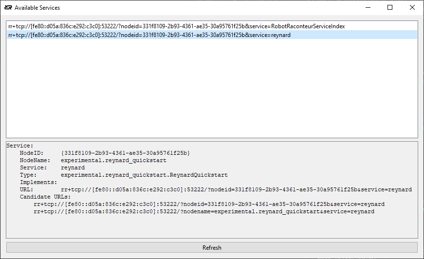

===========
Quick Start
===========

The quick start includes three short examples to get you up and running with the Robot Raconteur communication
framework, fast!

The first example is a minimal driver for the iRobot Create 1, with example clients in Python, Matlab, and LabView.
The second example is a driver for the Python "turtlebot". This does not require a physical robot to use the example.
The third example is using the Robot Raconteur Training Simulator with a simulated iRobot Create.

All quick start example files can be found in the ``examples/quickstart`` directory.

Setup
=====

Before running the examples, install Python 3.8 or greater. At the time of this writing, the current Python version
is Python 3.11. Python can be downloaded from the `Python Download Page <https://www.python.org/downloads/>`_, 
or installed using a package manager such as ``apt``.

Install the required packages using ``pip``

.. code::

    python -m pip install --user robotraconteur pyserial opencv-contrib-python

.. note::

    On Ubuntu, Debian, and other versions of Linux, replace ``python`` with ``python3`` in all examples. It may
    also be necessary to install the ``python3-pip`` package.

The ``robotraconteur`` Python package is available for most platforms using the ``pip`` installer, but for some
platforms it needs to be installed separately. See the 
`Robot Raconteur Install <https://github.com/robotraconteur/robotraconteur/blob/master/docs/common/installation.md>`_ 
page for more information on these platforms.

iRobot Create Quick Start
=========================

The iRobot Create example creates a minimal Robot Raconteur service to drive an iRobot Create using the serial port.
This example will work with the iRobot Create version 1 and 2.

iRobot Create Minimal Python Service
------------------------------------

The example uses a "service definition" with a single object, ``CreateObj``, and a single function ``drive``. ``drive``
takes two parameters, the command ``velocity`` and ``radius`` of the robot motion. 

.. code::

    service experimental.minimal_create,

    object CreateObj
        function void drive(int16 velocity, int16 radius)
    end

More information about Service Definitions can be found in the 
`Service Definition Framework Documentation <https://robotraconteur.github.io/robotraconteur/doc/core/latest/cpp/service_definition.html>`_ 
page.

Now, a simple service written in Python can be created:

.. literalinclude:: ../../../examples/quickstart/minimal_create_service2.py    

Replace ``/dev/ttyUSB0`` with the appropriate serial port name for your device.

iRobot Create Clients
---------------------

The iRobot Create service can now be called by a connecting client. Because of the magic of Robot Raconteur, 
it is only necessary to connect to the service to utilize its members. In Python and MATLAB there is no 
boilerplate code, and in the other languages the boilerplate code is generated automatically.

.. literalinclude:: ../../../examples/quickstart/minimal_create_client2.py
    

In MATLAB, this client is even simpler.

.. literalinclude:: ../../../examples/quickstart/minimal_create_client2.m

    

.. |View Robot Raconteur Matlab on File Exchange| image:: https://www.mathworks.com/matlabcentral/images/matlab-file-exchange.svg
   :target: https://www.mathworks.com/matlabcentral/fileexchange/80509-robot-raconteur-matlab

The `Robot Raconteur Matlab <https://www.mathworks.com/matlabcentral/fileexchange/80509-robot-raconteur-matlab>`_ 
add-on can be installed using "Get Add-Ons" in MATLAB.

LabView can also be used to drive the robot:

.. image:: images/labview_minimal_create_client.png
   :alt: LabView minimal iRobot Create client
   :name: LabViewCreateClient
   :width: 600

The Robot Raconteur LabView toolbox is a commercial product available from Wason Technology, LLC.

These example clients all use a URL to connect to the robot. "Discovery" and "Subscriptions" can also be used
to connect automatically to devices, even if the URL is not known.

.. literalinclude:: ../../../examples/quickstart/minimal_create_client2_sub.py

Subscriptions can use "Filters" to select which service to connect. See the documentation for 
`SubscribeServiceByType <https://robotraconteur.github.io/robotraconteur/doc/core/latest/python/api/RobotRaconteurNode.html#RobotRaconteur.RobotRaconteurNode.SubscribeServiceByType>`_
for more information on filters.

Service Browser
---------------

The `Robot Raconteur Service Browser <https://github.com/robotraconteur/RobotRaconteur_ServiceBrowser>`_ 
is a utility to browse services available on the network and find connection information.

The URL can be cut and paste from the information display. Note that this URL uses an IPv6 link-local address 
``fe80::ba27:ebff:fec4:212d`` instead of the more common IPv4 address. IPv6 addresses are favored by Robot Raconteur
since the they do not require as much configuration as IPv4 when working on a local network and are more reliable.